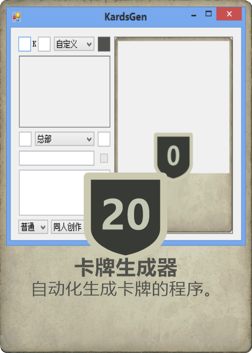

# KardsGen
Kards游戏风格卡牌生成器

使用本工具前请先确认[免责声明](免责声明.md)的内容，若使用本工具则视为同意免责声明

使用SharpDevelop编写，整改了项目文件用.net sdk编译，不过会报判空警告。

代码写得很烂，不少位置参数硬编码，算个能用的东西

### 用法
- 根据自己的想法写出卡牌名称和描述
- 填写部署花费（或使用花费）、行动花费、攻击力和防御力等数值（一些卡牌类型会忽略某些数值，可不填写）
- 选择卡牌的所属国家、类型和稀有度
- 添加图片：将图片拖进窗口 / 点击图片预览框打开（取消会清空图片）
	- （也可将图片直接拖到程序文件上打开，或在命令行中传递图片路径）
- 裁剪图片：可以通过右键图片预览框拖动选择裁剪范围
	- 按ESC可取消当前裁剪或退出裁剪窗口
	- 按F12或回车重置范围为全图（不显示范围）
	- 重置范围后再按F12或回车直接退出裁剪
- 点击卡牌预览框保存自制卡牌

（程序输入框根据卡牌对应位置进行排版）

### 计划添加的功能
（不一定会做，太懒了。有其他意见欢迎提出）
- 在右下角添加自定义图标
- 可添加自定义国家图标及颜色
- 添加非游戏卡牌，如每日任务卡牌等
- 可将卡牌保存至文件中或读取卡牌文件
- 可将多个卡牌作为卡组保存成文件并能读取
	- （有点不像是卡牌生成器该干的事）

### 构建
- .NET SDK
	- 在项目目录打开控制台窗口，输入`dotnet msbuild /p:Configuration=Release /p:Platform=x64`（或直接使用[构建脚本](build.bat)）

可以使用[Zack.DotNetTrimmer](https://github.com/yangzhongke/Zack.DotNetTrimmer)进行裁剪
- 如果不使用或无法使用[Zack.DotNetTrimmer](https://github.com/yangzhongke/Zack.DotNetTrimmer)，可以换个windows特有的土方法：运行程序并尝试使用一些功能，同时尝试删除程序的所有文件。
	- 原理：被程序调用到的程序集就会被文件锁给锁住，无法删除，就这样自动清掉了未调用的程序集。（可以复制一份裁剪过的程序，再把回收站里刚才删掉的程序集还原，避免积攒垃圾文件）
	- 为以防万一，可以把土方法裁剪过后的程序覆盖到先前使用[Zack.DotNetTrimmer](https://github.com/yangzhongke/Zack.DotNetTrimmer)裁剪的程序目录里，以保证不缺少文件。

### 素材
- 图片素材取自Kards官网各卡牌
- 图标素材取自Kards官网网页元素矢量图，图标微调白色，使用[Free SVG Editor](https://freepicturesolutions.com/free-svg-editor.html)导出png素材
	- 攻击和防御背景板修改自法国svg图标，特殊攻击背景板自制
	- 防御背景板需在上面选中图形，把Scale调成0.5导出
- 模板为[Hornil StylePix](https://www.hornil.com/en/stylepix/download/)项目

### 细节缺陷
- 空军卡牌没有其特殊国家图标
- 数值背景板和类型图标边框因取自svg矢量图素材，全部为纯色，实际上应该是卡面背景图
- 无法制作闪卡
- 根据便利性作出的妥协
	- 作者比较懒，贴图和文本位置没啥大问题就懒得再调整
	- 字体使用了系统内置的Microsoft YaHei UI（微软雅黑），实际上思源黑体最为还原
- 目前无法添加自制图标
- 无法添加粗体文本