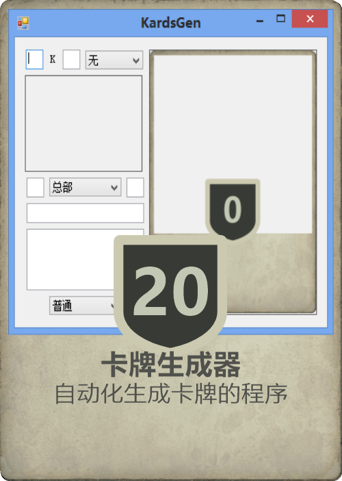

# KardsGen
Kards游戏风格卡牌生成器

使用本工具前请先确认[免责声明](免责声明.md)的内容，若使用本工具或分发有关本工具的信息则视为同意免责声明



使用SharpDevelop编写，整改了项目文件用.net sdk aot发布，不过会报判空警告。

介于本人恶趣味，我还把项目介绍写成了[论文形式项目介绍](论文形式项目介绍.md)，欢迎大家前去赤石盒袅，能赤完的是这个👍。
~~这东西是我在毕业季做出来的，所以四舍五入这个项目也能算是我的毕业设计。~~


代码写得很烂，不少位置参数硬编码，算个能用的东西


### 用法
（可以在右上角点击帮助按钮，点击帮助按钮后再点击需要帮助的地方显示说明文本；点击帮助按钮后点击右上角的`K`可查看该项目及使用的库的许可证）
- 根据自己的想法写出卡牌名称和描述
	- 卡牌名称编辑框旁边有深色名称开关，在选择自定义国家时可以切换，以应对可能的浅色背景板
	- 卡牌描述文本能自动调整尺寸，将其限制在一个固定的高度范围内
	- 卡牌描述文本标粗词条需在卡牌描述开头添加字符`#`
- 填写部署花费（或使用花费）、行动花费、攻击力和防御力等数值（一些卡牌类型会忽略某些数值，可不填写）
	- 数值文本能自动调整尺寸，但无固定范围限制
- 选择卡牌的所属国家、类型、稀有度和套装
	- 可以添加自定义国家图片及单位名称背景板颜色（图片尺寸不会缩放）。选中“自定义”选项后，左键点击旁边的国家图标预览框或直接将图片拖拽到其上添加，若左键点击后未选择图片直接退出则清空图片，右键点击选择颜色。
	- 可以选择卡牌套装（卡牌右下角的版本图标），同时包含同人创作（Fan Made）和自定义选项，自定义选项可以添加任意图片（图片尺寸不会缩放）。选中“自定义”选项后，点击旁边的套装图标预览框或直接将图片拖拽到其上添加，若左键点击后未选择图片直接退出则清空图片。
- 添加图片：将图片拖进窗口 / 点击图片预览框打开（取消会清空图片）
	- 该方法适用于除卡牌预览框外的所有预览框
	- （目前添加卡面图片也可将图片直接拖到程序文件上打开，或在命令行中传递图片路径）
- 裁剪图片：可以通过右键图片预览框拖动选择裁剪范围
	- 按ESC可取消当前裁剪或退出裁剪窗口
	- 按F12或回车重置范围为全图（不显示范围）
	- 重置范围后再按F12或回车直接退出裁剪
- 点击卡牌预览框保存自制卡牌
	- 左键保存图片
	- 右键保存卡牌文件（ini格式）
	- 拖拽卡牌文件到上面可以加载卡牌文件
		- 卡牌文件可手动编辑，具体格式查看[卡牌文件格式说明](卡牌文件格式说明.md "卡牌文件格式说明")


（程序输入框根据卡牌对应位置进行排版）

### 计划添加的功能
（不一定会做，太懒了。有其他意见欢迎提出）
- 添加自定义卡牌类型支持
- 生成对战时的小卡牌
- 为卡牌添加激活与未激活、数值增减、被收缴等状态
- 添加非游戏卡牌，如每日任务卡牌等
- 可将卡牌保存至文件中或读取卡牌文件
- 可将多个卡牌作为卡组保存成文件并能读取
	- （有点不像是卡牌生成器该干的事）

### 构建
- .NET SDK
	- 在项目目录打开控制台窗口，输入`dotnet msbuild /restore /p:Configuration=Release /p:Platform=x64`（或直接使用[构建脚本](build.bat)）

### 发布AOT程序
- .NET SDK
	- 在项目目录的KardsGen文件夹下打开控制台窗口，输入`dotnet publish /restore`（或直接使用[发布脚本](publish.bat)）
		- （不知道什么原因，使用publish模式生成aot程序时，如果使用`dotnet msbuild`，程序能成功生成，但是无法直接运行，程序体积也异常小）
- Visual Studio C++桌面开发环境
	- 可手动修改`C:\Users\pc\.nuget\packages\microsoft.dotnet.ilcompiler\[包版本]\build\Microsoft.NETCore.Native.Windows.targets`的内容以手动添加msvc的link和lib路径以及windows sdk库路径，但较为复杂。建议仅在现有条件不支持直接安装Visual Studio C++桌面开发环境时使用此方法。
		- 示例：

```xml
    <!--将最后有关VCVarsAll的配置全部注释掉并根据以下格式添加类似配置-->
	<!--本示例中所有依赖文件都存至microsoft.dotnet.ilcompiler\[包版本]\build\dotnet-aot-minimal-dependency路径下-->
    <ItemGroup>
      <!--winsdk lib path-->
      <AdditionalNativeLibraryDirectories Include="$(MSBuildThisFileDirectory)dotnet-aot-minimal-dependency\Windows Kits\10\Lib\10.0.26100.0\um\x64\" />
      <AdditionalNativeLibraryDirectories Include="$(MSBuildThisFileDirectory)dotnet-aot-minimal-dependency\Windows Kits\10\Lib\10.0.26100.0\ucrt\x64\" />
    </ItemGroup>

    <PropertyGroup>
      <!--msvc bin path-->
      <_CppToolsDirectory>$(MSBuildThisFileDirectory)dotnet-aot-minimal-dependency\MSVC\14.29.30133\bin\Hostx64\x64\</_CppToolsDirectory>
      <CppLinker>$(_CppToolsDirectory)link.exe</CppLinker>
      <CppLibCreator>$(_CppToolsDirectory)lib.exe</CppLibCreator>
    </PropertyGroup>
```


### 素材
- 图片素材取自Kards官网各卡牌
- 图标素材取自Kards官网网页元素矢量图，图标微调白色，使用[Free SVG Editor](https://freepicturesolutions.com/free-svg-editor.html)导出png素材
	- 攻击和防御背景板修改自法国svg图标，特殊攻击背景板和中立国家图标自制
	- 空军国家图标使用[Friction](https://friction.graphics/)仿照卡牌绘制矢量图后导出为svg并使用官方附带发行的svg简化程序svgo简化并手动修改，最后使用[Free SVG Editor](https://freepicturesolutions.com/free-svg-editor.html)导出png素材
	- （显示范围有问题的svg已通过viewBox进行修正，无需再修改内部元素，在[Free SVG Editor](https://freepicturesolutions.com/free-svg-editor.html)中调整尺寸后即可直接导出）
- 模板为[Hornil StylePix](https://www.hornil.com/en/stylepix/download/)项目

### 项目缺陷
- 只能生成普通大小的卡牌图片(500×702)，卡牌原始大小应为1448×2034
- 数值背景板和类型图标边框因取自svg矢量图素材，全部为纯色，实际上应该是卡面背景图
- 无法制作闪卡
- 根据便利性作出的妥协
	- 作者比较懒，贴图和文本位置没啥大问题就懒得再调整
	- 字体使用了系统内置的Microsoft YaHei UI（微软雅黑），实际上思源黑体最为还原
- 无法添加粗体文本

### 本项目使用的其他项目
- [Ini](https://github.com/Enichan/Ini "Ini file reader/writer for C#/.NET written in pure .NET in a single source file.")
- [WinFormsComInterop](https://github.com/kant2002/WinFormsComInterop "ComWrappers required to run NativeAOT and WinForms")