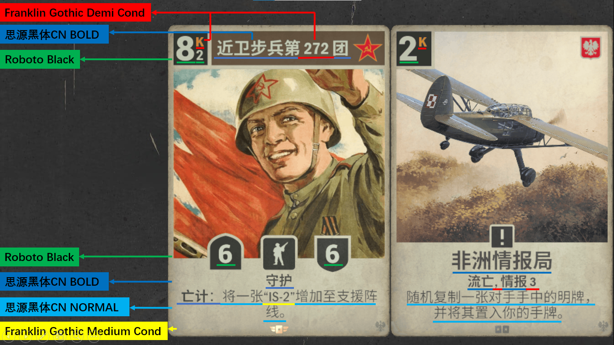

# 一种基于C#建立的仿照Kards游戏卡牌风格的卡牌生成系统

## 摘要

Kards是一种以二战历史为模板制作的卡牌策略游戏，其游戏运营在社区中差评居多，但游戏精致的美术风格受到了广大玩家的认同。在Kards游戏的社区中广泛存在着自制卡牌以交流创意的爱好，然而自制卡牌需要查找和理解其规则，常常需要查找模板并了解复杂的卡牌格式，并操作特定的图片编辑软件，导致进行自制卡牌这一活动门槛较高。由于本人是编程爱好者，故尝试利用编程实现一套自动化生成相似风格卡牌的生成系统，这也是本研究的目标。本研究基于C#实现了一种能够自动化生成相似于Kards游戏卡牌风格的自定义卡牌，并将其源代码和详细制作过程开源至Github。

关键词：C#，.NET，Winform，卡牌生成

--------------------------------------------------------------------------------

# A KARDS-GAME-STYLE CARD GENERATING SYSTEM WHICH BUILDED WITH C # #

## ABSTRACT

Kards is a card strategy game based on the history of World War II, and its game operation has received most negative reviews in the community, but the game's exquisite art style has been recognized by the majority of players. There is a widespread hobby of making cards to communicate ideas in the Kards community, but creating cards requires finding and understanding their rules, often finding templates and understanding complex card formats, and operating specific image editing software, which leads to a high barrier to entry for homemade cards. Since I am a programming enthusiast, I tried to use programming to implement a system that automatically generates cards of a similar style, which is also the goal of this study. Based on C#, we implemented a custom card that can automatically generate cards similar to the card style of Kards games, and open source the source code and detailed production process to Github.

**KEYWORD**：C#，.NET，Winform，Card Generation

--------------------------------------------------------------------------------

## 目录

Ⅰ. [摘要](#摘要)

Ⅱ. [ABSTRACT](#ABSTRACT)

1. [绪论]("#1-绪论")
   
	1.1 [C#的研究背景与意义](#1.1-C#的研究背景与意义)
   
	1.2 [Winform的研究背景与意义](#1.2-Winform的研究背景与意义)

	1.3 [GDI+框架的研究背景与意义](#1.3-GDI+框架的研究背景与意义)

2. [卡牌生成程序的设计](#2-卡牌生成程序的设计)

	2.1 [程序具体实现方式](#2.1-程序具体实现方式)
   
	2.2 [Kards卡牌格式](#2.2-Kards卡牌格式)

	2.3 [卡牌生成系统](#2.3-卡牌生成系统)

	2.4 [卡牌生成器界面](#2.4-卡牌生成器界面)

	2.5 [程序操作方法设计](#2.5-程序操作方法设计)

3. [卡牌视觉元素的实现方法](#3-卡牌视觉元素的实现方法)
   
	3.1 [卡牌基础元素](#3.1-卡牌基础元素)

	3.2 [卡牌状态元素](#3.2-卡牌状态元素)

	3.3 [卡牌自由元素](#3.3-卡牌自由元素)

4. [卡牌生成器的未来发展方向](#4-卡牌生成器的未来发展方向)
    
	4.1 [卡牌生成器的缺陷](#4.1-卡牌生成器的缺陷)

	4.2 [卡牌生成器未来计划添加的功能](#4.2-卡牌生成器未来计划添加的功能)

5. [其他相似项目](#5-其他相似项目)
   
	5.1 [随机卡牌生成器](#5.1-随机卡牌生成器)

	5.2 [DIY-KARD](#5.2-DIY-KARD)

	[致谢](#致谢)

	[参考文献](#参考文献)

--------------------------------------------------------------------------------

## 1 绪论

### 1.1 C#的研究背景与意义

C#是由微软开发的一种面向对象的语言，其目标是为制作Windows应用端可执行程序提供更好的支持，C#发布时随同其工具链.NET Framework一同发布，同时它官方支持多语言，如Visual Basic.NET、JScript、F#等，也可以由第三方接入其他语言支持，如Boo、IronPython、IronRuby等。现在.NET Framework 4由Windows系统内置，基于.NET Framework运行时的应用程序可以直接在预装Windows系统上运行。.NET Framework已经在很多工业自动化控制领域软件中广泛使用。

随着微软逐渐拥抱开源，其开源的统一开发工具.NET SDK也逐渐被越来越多的人使用，同时微软也不断在.NET SDK上进行技术更新。.NET SDK兼容曾经以.NET Framework为生成目标的代码，可以将生成的程序与所依赖的运行时一同打包，甚至支持将.NET语言代码进行aot生成本机应用程序（对一些功能支持有限，如winform、wpf框架），做到不依赖外部程序集，方便程序分发。使用C#制作程序，可以拥有.NET界面开发的简便性和兼容性，适合制作简易的自动化工具。

### 1.2 Winform的研究背景与意义

Winform是一种由.NET支持的Windows图形界面应用程序框架，旨在减少图形界面应用程序的开发难度。Winform通过封装Winapi、GDI+、COM互操作等功能，为开发者提供一个简易灵活的界面操作框架。使用Winform可以简易快速地开发程序界面，同时其代码也能保证结构简单和可读性。

### 1.3 GDI+框架的研究背景与意义

GDI+是微软基于GDI技术开发的对图像处理提供更多支持的一个拓展框架，它可由C/C++程序调用，同时它也是C#图形处理和Winform框架的底层技术支持，内置于Windows系统中。在使用GDI+的代码中，只需要还原对GDI+库函数相同的调用方法，就能得到相同的结果，故GDI+库也能方便不同语言的代码互相转写。

## 2 卡牌生成程序的设计

### 2.1 程序具体实现方式

当今的编程语言数量众多，各有其不同优势和用途，例如C/C++适用于效率敏感型用途、Python适用于通用脚本化操作等，在Windows上对图形界面开发支持良好的语言是C#，同时它也拥有一个第三方的轻量化集成开发环境SharpDevelop，故本研究采用C#语言。

C#语言中有两大原生的界面开发框架：Winform和WPF，Winform框架简单易操作但存在部分功能和性能限制，WPF通过数据绑定进行更加复杂和结构化的界面开发，功能强大但操作较为复杂。本研究因不需要复杂的界面效果，故选用Winform框架。

介于生成卡牌的核心功能是由C#原生封装的GDI+库函数实现，故也可以在C/C++代码中还原其调用方法来实现同样的效果。实际上作者已使用C语言同样实现了卡牌生成器的命令行程序，其卡牌生成的核心代码与C#版本高度相似。

### 2.2 Kards卡牌格式

在Kards游戏中，卡牌需要描述其各类属性，信息很繁多，需要详细的研究和调查来了解其卡牌的具体格式。Kards卡牌的属性包括：

- 数值
	- 使用（部署）花费（不包括总部）
	- 行动花费（仅单位）
	- 攻击力（仅单位）
	- 防御力（仅目标）
- 文本
	- 卡牌名称（芬兰单位为浅色）
	- 卡牌描述
- 图像
	- 卡面图片
	- 国家图标
	- 卡牌所属套装
- 卡牌所属国家
- 卡牌类型
- 稀有度
- 国家名称背景板颜色（仅单位）

文本字体经过测试，Microsoft YaHei UI（微软雅黑）字体还原度最高。通过调查社区卡牌模板得知，卡牌文本格式较为复杂[[1]](#参考文献)。

> 图2.1 字体说明[[1]](#参考文献)

中文采用思源黑体，英文及其符号和数字使用Franklin Gothic字体，具体来说：卡牌描述基本使用思源黑体，卡牌名称和词条使用思源黑体粗体，卡牌名称和词条中的英文字符和数字还有标识花费的“K”使用Franklin Gothic Demi Cond字体，卡牌描述中的英文字符和数字使用Franklin Gothic Medium Cond字体。另外，卡牌自身的数值标识，即花费、攻击力和防御力均采用Roboto Black字体粗体。

介于完全还原文本格式非常复杂，故本研究文本仅采用Microsoft YaHei UI（微软雅黑）字体，该字体在Windows系统中普遍内置，故适合由轻量化程序使用。

### 2.3 卡牌生成系统

Kards游戏的卡牌需要描述其效果、数值、卡面图片等各种属性，这些都作为卡牌整体的一部分，因此需要通过创建一个类，并创建相应的字段存储对应信息来实现卡牌信息的存储，最后通过一个统一的方法生成卡牌图像。因绘制卡牌的操作较为繁杂，故将各部分功能拆分提取成独立的方法，最后由统一的方法调用。这些卡牌生成的核心代码全部集中在Cardgen.cs文件中[[2]](#参考文献)。

### 2.4 卡牌生成器界面

因为卡牌描述的信息较为繁杂，故卡牌生成最佳的方式就是点击卡牌对应位置即可编辑该位置的信息。但碍于Winform的功能限制难以实现，故使用类似于卡牌信息的位置排版，将填写卡牌信息的控件按相似排版集中在一个区域，将卡牌预览框放在该区域旁，以此同时兼顾操作的直观性和程序实现的简便性。

### 2.5 程序操作方法设计

在应用程序中，文本框控件可直接点击编辑文本使用，而对于图片框控件，通常需要更改图像或对图像进行处理，添加或更改图片采用左键预览框，与该图像有关的副操作，如更改背景板颜色，和裁剪图片，采用右键。裁剪图片使用最直观的拖拽裁剪，按回车或F12退回全屏范围，再次按回车或F12退出裁剪。

有关命令行操作，最开始仅能传入卡面图片，但由于C语言版本的初代命令行工具制作完成并可用，目前正考虑将命令行功能添加进项目中。命令行参数主要通过`-[缩写] [参数]`的形式传入。

## 3 卡牌视觉元素的实现方法

一张卡牌需要传递多种信息，因此卡牌包含多种视觉元素。从编程的角度来看，视觉元素的状态类别决定了它们的实现方法，因此在此将卡牌的视觉元素通过状态类别的方法分开讨论。

### 3.1 卡牌基础元素

一张卡牌包含某些固定的基础视觉元素，如卡牌框和花费背景板，只需要获取相应的静态资源，并根据一些流程固定绘制它们即可。这些素材裁剪自游戏官网收藏图鉴中的卡牌。

### 3.2 卡牌状态元素

一张卡牌也包含一些具有有限个固定状态的视觉元素，如国家、类型、稀有度和所属套装，将其状态全部用枚举表示并根据一些流程进行判断绘制即可。因这些素材具有不规则边缘，所以通常获取游戏官网某些界面网页元素中的svg图标，再使用Free SVG Editor导出为图像素材使用。因稀有度图标包含随机位置高光，故稀有度同样采用图片裁剪而成的素材，其高光位置固定不变。

为更广泛的自定义支持，国家和套装添加一个自定义状态，可在自定义状态下自由添加任意图像素材。这类元素本项目默认提供空值或第一个值。

### 3.3 卡牌自由元素

一张卡牌还包含一些不限状态的元素：卡牌文本、数值和卡牌图片。这类元素必须采用通用的基础字段以存储任何可能的信息，如string类型存储任意字符串、int存储任意整数、Image类型存储任意图像。因本项目仅简易实现其功能，同时尝试保持最大自由度，故这类元素本项目不提供默认值。

## 4 卡牌生成器的未来发展方向

### 4.1 卡牌生成器的缺陷

由于程序制作很简易，因此形成了一些功能上的缺陷。这些缺陷并非无法克服，但由于作者动力不足，导致这些问题未解决：
- 仅能生成普通大小的卡牌图片(500×702)，卡牌原始大小应为1448×2034
- 空军卡牌没有其特殊国家图标
- 数值背景板和类型图标边框因取自svg矢量图素材，全部为纯色，实际上应该是卡面背景图
- 无法制作闪卡
- 根据便利性作出的妥协
	- 作者动力不足，贴图和文本位置未出现明显缺陷则不尝试调整
	- 字体使用了系统内置的Microsoft YaHei UI（微软雅黑），实际上思源黑体最为还原
- 无法添加粗体文本
- 无法单独添加词条

### 4.2 卡牌生成器未来计划添加的功能

介于作者动力不足，以下功能可能已经形成大致的概念，但不做实现保证：
- 生成对战时的小卡牌
- 为卡牌添加激活与未激活、数值增减、被收缴等状态
- 添加非游戏卡牌，如每日任务卡牌等
- 可将卡牌保存至文件中或读取卡牌文件
- 可将多个卡牌作为卡组保存成文件并能读取
	- 或需另外开发一个项目，将本项目全部集成进去

## 5 其他相似项目

由于作者信息较闭塞，在他人制作了类似的卡牌制作工具后，仍然自行开发完成了本项目，在本工具开发完毕后作者才了解到相关信息，目前作者仍然计划继续开发本项目。

### 5.1 随机卡牌生成器

该项目由晦涩弗里曼开发[[3]](#参考文献)，项目初期为网页项目，后续开发集中在electron框架上，因此新功能包含在客户端版本中。该项目实现了卡牌编辑最直观的方式：点击对应位置编辑信息，并且实现了卡牌轻微的三维旋转、反光效果，提高了沉浸感，该项目还能够随机生成卡牌的各种信息，数值、名称、描述、卡牌图片、国家都能随机生成，可以为自创卡牌设计提供有趣的想法。或由于该项目重点在随机生成，自由度略显不足，无法自行选择卡牌类型和国家，并且无法生成指令和反制，其文本尺寸和位置较原版卡牌风格也差距较大。

### 5.2 DIY-KARD

该网页完整还原了卡牌的所有元素，对卡牌设计的所有功能都提供了完整的支持，如空军、总部、闪卡等，并且提供了一定的自由度，能够由用户调整图片及文本的位置和尺寸，还添加了扩展功能如谚语功能[[4]](#参考文献)。社区中有人反映文本位置出现问题，而后该项目作者积极修复，为各类设备都提供了良好支持。该项目作者考虑到社区影响，呼吁使用者不得滥用该工具。

--------------------------------------------------------------------------------

## 致谢

感谢前来赤石的你。

--------------------------------------------------------------------------------

## 参考文献

1. [【KARDS】DIY卡牌教程!-哔哩哔哩](https://www.bilibili.com/video/BV1Aj421S76C/) 
2. [Kards游戏风格卡牌生成器](https://github.com/Lasereyes5/KardsGen)
3. [【KARDS】自制软件，随机生成逆天卡牌，还可以随意DIY？-哔哩哔哩](https://www.bilibili.com/video/BV1VqVBzUEBY)
4. [diy-kard](https://diykard.fun/#/card/make/option)
